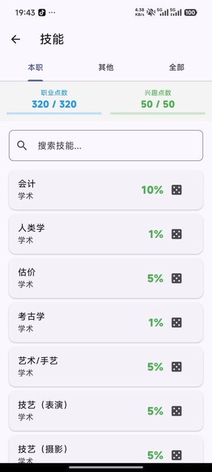
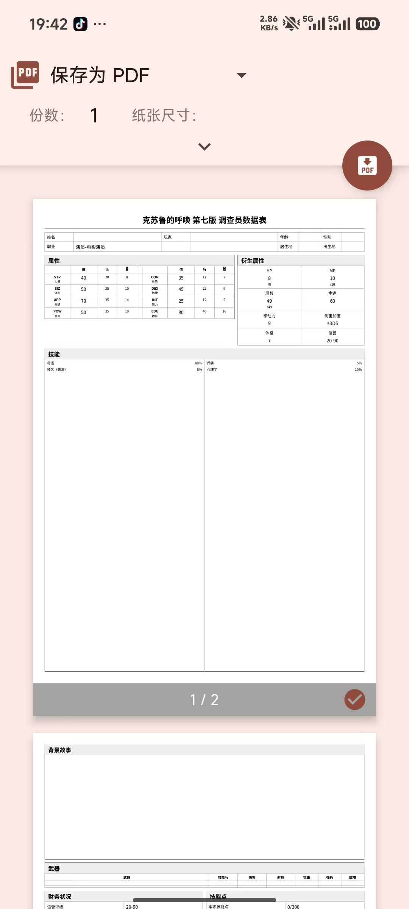
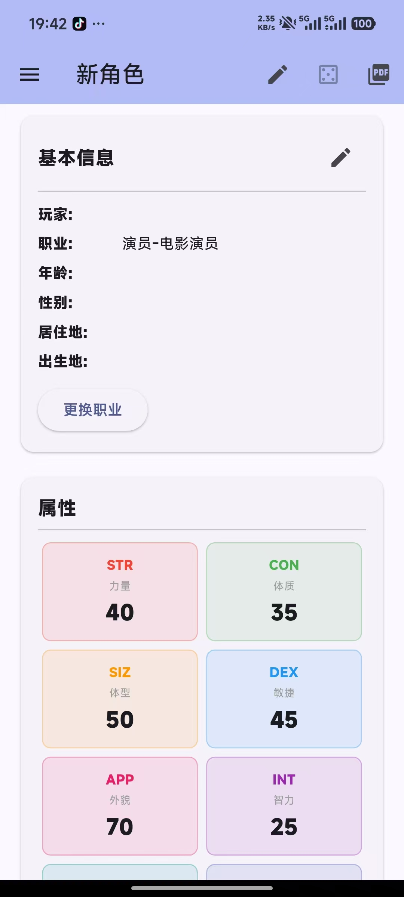

# COC 角色卡

克苏鲁的呼唤第七版调查员角色卡应用。项目基于 Flutter 构建，面向移动端、桌面端与 Web，重点覆盖建卡、游玩记录、技能检定、理智事件和 PDF 导出等桌面团常用流程。

## 当前功能

- 多角色管理：创建、切换、删除与恢复误删提示，角色数据本地持久化；支持复制、粘贴单张人物卡角色码。
- 手动建卡：支持天命 N 组属性、购点 X 点、运气是否参与分配、职业选择、自定义职业公式与技能点分配。
- AI 辅助建卡：使用 DeepSeek 生成属性、职业、技能、背景、外貌与物品，并在入库前提供可编辑预览。
- 头像管理：支持相册/相机选择头像，也可配置 SiliconFlow 或智谱 CogView 生成 AI 头像。
- 角色卡主页：管理基本信息、头像、属性、HP/MP/SAN/幸运、武器、背包、财务、背景故事与外貌。
- 衍生属性计算：自动计算 HP、MP、SAN 上限、移动率、体格、伤害加值、职业点与兴趣点；游玩中修改属性时会尽量保留当前损耗。
- 技能系统：内置 COC7 技能列表、职业技能筛选、已加点筛选、搜索、职业点/兴趣点投入与一键 D100 检定。
- D100 规则：支持 COC7 默认、常用村规和自定义大成功/大失败阈值；失败时可按规则花费幸运补正。
- 技能检定日志：保存最近检定记录，支持按技能、成功等级和日期筛选、清理，并导出 CSV 或 JSON。
- 幕间技能成长：成功检定自动标记待成长，幕间可逐项或批量进行成长检定，成长成功后提升 1D10。
- 理智流程：支持 `1d6`、`2d6+1`、固定数值等 SAN 损失表达式，自动扣减 SAN、触发 INT 检定、生成临时疯狂结果并保存历史。
- 武器管理：可手动添加武器，也可从内置武器库搜索并加入角色卡。
- 参考资料：内置规则快查、疯狂发作、恐惧症、躁狂症表，以及守秘人规则书 PDF 阅读入口。
- PDF 导出：生成两页中文调查员数据表，可打印或分享。
- 数据备份：角色 JSON 备份导出、剪贴板复制、系统分享与追加/覆盖导入。
- 本地投骰：D100 与 3D6 本机投骰，保存最近 50 条本地历史。
- 主题：浅色/深色主题切换。

## 预览截图





## 技术栈

- Flutter 3.24+ / Dart 3.5+
- Provider
- SharedPreferences
- path_provider
- pdf / printing
- http
- image_picker

## 本地配置

首次运行前需要创建本地密钥文件：

```bash
cp lib/app/setting/secrets.dart.example lib/app/setting/secrets.dart
```

`secrets.dart` 已加入 `.gitignore`。可以保持默认空值，然后在应用的设置页填写 DeepSeek、SiliconFlow 或智谱 API Key；也可以在本地文件里配置默认 DeepSeek Key。

## 运行与测试

```bash
flutter pub get
flutter test
flutter run
```

如需指定平台，可使用：

```bash
flutter run -d chrome
flutter run -d macos
flutter run -d windows
flutter run -d android
```

## 构建

```bash
flutter build apk
flutter build ios
flutter build macos
flutter build windows
flutter build web
```

iOS 与 macOS 构建需要 macOS 和 Xcode；Android 构建需要 Android SDK。Windows 构建请在 Windows 环境执行。

## 项目结构

- `lib/app/pages/`：页面入口，包括主页、建卡、AI 建卡、技能、武器、设置与参考表。
- `lib/app/data/`：角色、技能、检定规则、理智事件等核心数据模型与管理逻辑。
- `lib/app/services/`：PDF、AI 文本生成、头像图像生成与头像存储。
- `lib/app/widgets/`：角色卡组件、头像组件、投骰组件等可复用 UI。
- `assets/`：图片、字体和规则书 PDF 等资源。
- `test/`：检定、成长、理智、导出、AI 服务等单元和组件测试。

## 开发中/规划中

`docs/feature-proposals/` 中记录了联机骰点房间、战斗追踪器等后续设计方案；这些文档是规划，不代表当前版本已经提供对应功能。
